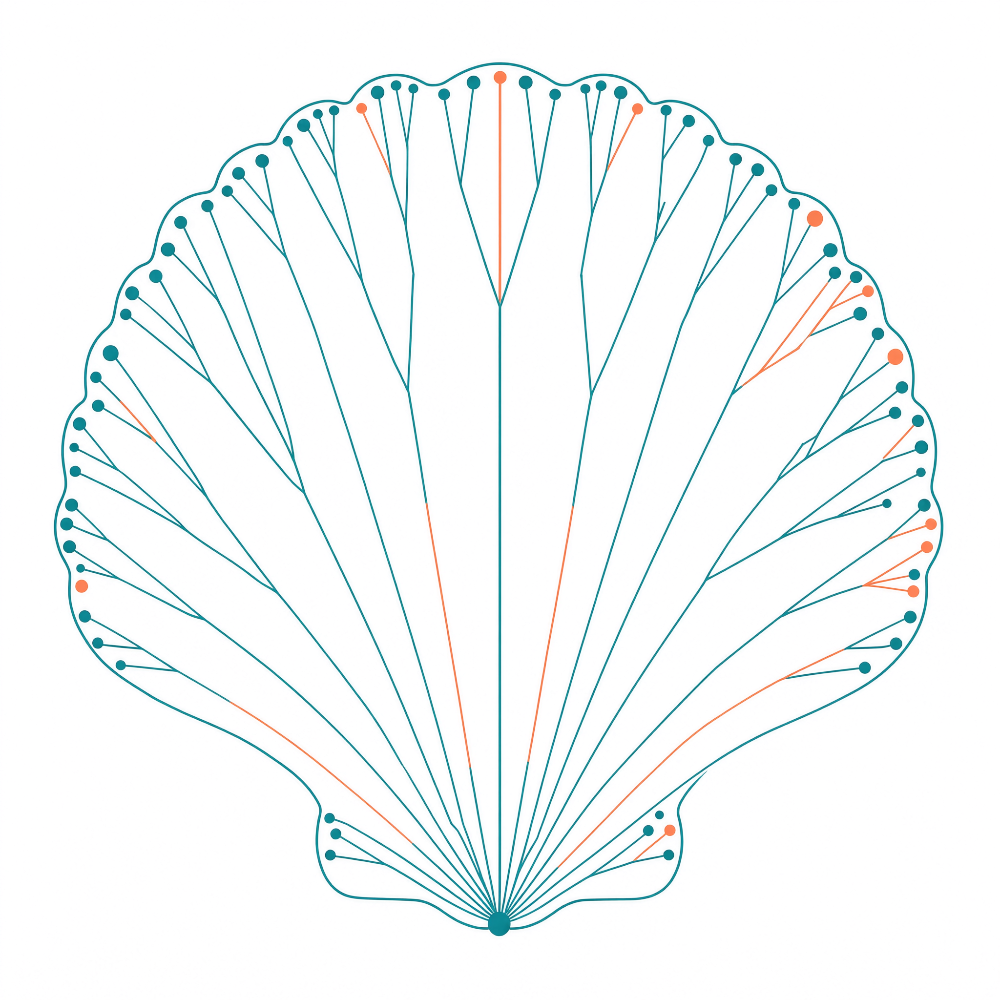

<p align="center">
  
</p>

<h1 align="center">CaMi — Cancer&ndash;Microbiome interaction</h1>

<p align="center">
  <a href="https://github.com/alihkz94/CaMi/actions/workflows/ci.yml"></a>
  <a href="https://github.com/alihkz94/CaMi/actions/workflows/containers.yml"></a>
  <a href="https://www.nextflow.io/"></a>
  <a href="LICENSE"></a>
</p>
CaMi recovers the microbial reads that come incidentally with host genome
sequencing, and compares them between tumour and matched healthy tissue from the
same animal.

Developed on the transmissible cancer of the common cockle *Cerastoderma edule*
(ENA study PRJEB58149, 563 runs). Nothing in the pipeline is specific to cockles
— it works for any host and any disease.

## What it does

```
raw reads
   |
   |  01  trim adapters and low quality bases            fastp
   |  02  remove host reads                              BWA-MEM2 + coverage/identity filter
   |  03  remove human reads                             minimap2 + coverage/identity filter
   |  04  remove duplicates          -> MICROBIAL READ SET
   |
   |  05  assign taxonomy from nucleotide k-mers         Kraken 2
   |  06  estimate abundance                             Bracken
   |  07  assign taxonomy from protein sequence          Kaiju
   |  08  combine every sample, run the QC gate
   |
   |  09  tidy count tables
   |  10  derive the within-individual tumour/host pairs
   |  11  exact paired differential abundance            permutation + Wilcoxon + BH
   v
results/
```

The microbial fraction is under 1 % of the reads, so small changes to a filter
change the answer. The thresholds were calibrated against a false-positive floor
— see [docs/methods.md](docs/methods.md) before changing them.

## Quick start

Point it at the FASTQ you already have:

```bash
nextflow run alihkz94/CaMi \
    -profile singularity,slurm \
    --input /path/to/fastq \
    --dataRoot /path/to/cohort \
    --kraken_db /path/to/kraken2/standard_16gb \
    --run_kaiju false \
    --step all -resume
```

`--input` takes a directory of paired FASTQ, or a samplesheet:

```csv
sample,fastq_1,fastq_2,individual,tissue,disease_status,dna_prep
T01,/data/T01_R1.fastq.gz,/data/T01_R2.fastq.gz,animal_01,haemolymph,tumor,native
H01,/data/H01_R1.fastq.gz,/data/H01_R2.fastq.gz,animal_01,foot,matched host,native
```

The first three columns run the profiling. The last four build the paired
tumour-vs-host design for `--step STATS`; leave them out and everything else
still runs.

**Nothing is downloaded.** If your reads come from ENA instead, fetch them once
with [scripts/download/](scripts/download/README.md) and CaMi picks them up from
the manifests without `--input`.

You need Nextflow and a container engine; the images are pulled automatically.
`-resume` continues an interrupted run without repeating finished work.

Full details: [docs/usage.md](docs/usage.md).

## Profiles

Combine one executor with one software profile, e.g. `-profile singularity,slurm`.

| Executor | Software |
|---|---|
| `local` (default) | `singularity` (recommended) |
| `slurm` | `apptainer` |
| `sge` | `docker` |
| `lsf` | `podman` |
| | `conda` |

`test` runs a small check. `mpi_bremen` is the site the study was run on, kept as
an example of a cluster with node-local storage.

Use `singularity` for published work: a conda solve re-resolves dependencies at
install time, while an image is the same on every machine.

## Steps

| Step | What it does |
|---|---|
| `REFERENCE` | download the genomes and build the indexes (~40 min, once) |
| `FETCH_BAM` | recover runs that ENA holds only as BAM — the ENA route only; skipped when there is no such manifest |
| `PROFILE` | the analysis |
| `STATS` | the paired differential abundance test |
| `all` | the first three, in order |

## Key results

**Do not filter host reads by MAPQ.** Low MAPQ means the aligner cannot choose
between repeat copies, not that a read is foreign. Filtering on MAPQ called
15.2 % of cockle reads microbial; those reads were 99.33 % unclassified cockle.
CaMi filters on alignment coverage and identity instead.

**Check the false-positive floor before setting a confidence threshold.**
Classifying 2,000,000 fragments of pure cockle DNA — where every bacterial call
is wrong by construction — showed that any setting with `--confidence >= 0.05`
reports fewer bacteria than host DNA alone produces.

| Setting | Real reads | Host-only floor | Signal / noise |
|---|---|---|---|
| **standard-16 conf 0** (default) | 0.0529 % | 0.0101 % | **5.2 ×** |
| PlusPF conf 0 | 0.3700 % | 0.1297 % | 2.9 × |
| standard-16 conf 0.1 | 0.0003 % | 0.0009 % | 0.33 × |

**`Homo` in a Kraken report is not contamination.** Standard-16 contains one
eukaryote, human. Cockle is absent, so cockle reads are either unclassified or
wrong: the cockle assembly classifies as 99.998 % *Homo sapiens*.

**Run Kaiju as well as Kraken 2.** On the same reads Kraken 2 found 210 bacterial
pairs and Kaiju found 3,249. Nucleotide *k*-mers miss marine organisms with no
close relative in a database; protein search does not.

## Documentation

| | |
|---|---|
| [docs/usage.md](docs/usage.md) | how to run it |
| [docs/output.md](docs/output.md) | what it writes |
| [docs/methods.md](docs/methods.md) | why the thresholds are what they are |
| [docs/statistics.md](docs/statistics.md) | the paired design and the test |
| [containers/README.md](containers/README.md) | the images |

## Authors

Ali Hakimzadeh and Alicia L. Bruzos.

## Licence

[MIT](LICENSE).
